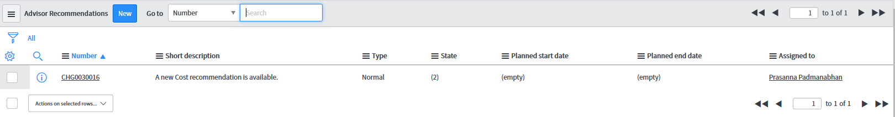
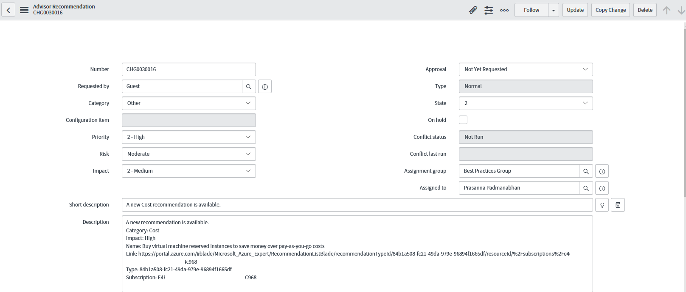

# Configure Azure Advisor alerts in ServiceNow

This article shows you how to integrate Azure Advisor alerts with ServiceNow using a webhook. After setting up webhook integration with your ServiceNow instance, you get alerts through your existing notification infrastructure when a new Azure Advisor recommendation is available. Every time an Azure Advisor alert fires, it calls a webhook through ServiceNow's Scripted REST API.

The goal is to create a new change request in ServiceNow whenever a new Azure Advisor recommendation is available. Once the change request is Approved within ServiceNow, the responsible person can then implement the suggested action(s) associated with the Azure Advisor recommendation.

The steps are very similar to those listed at https://docs.microsoft.com/en-us/azure/service-health/service-health-alert-webhook-servicenow.

You will be using the following JavaScript code:

>You need to update the `<secret>`,`<group>`, and `<email>` value in the script below.
>* `<secret>` should be a random string, like a GUID
>* `<group>` should be the ServiceNow group you want to assign the incident to
>* `<email>` should be the specific person you want to assign the incident to (optional)
>

```javascript
    (function process( /*RESTAPIRequest*/ request, /*RESTAPIResponse*/ response) {
        var apiKey = request.queryParams['apiKey'];
        var secret = '<secret>';
        if (apiKey == secret) {
            var event = request.body.data;
            var responseBody = {};
            if (event.data.context.activityLog.operationName == 'Microsoft.Advisor/recommendations/available/action') {
                var inc = new GlideRecord('recommendation');
                inc.initialize();
                inc.short_description = "A new " + event.data.context.activityLog.properties.recommendationCategory + " recommendation is available.";
                inc.description = event.data.context.activityLog.description + "\n";
                inc.description += "Category: " + event.data.context.activityLog.properties.recommendationCategory + "\n";
                inc.description += "Impact: " + event.data.context.activityLog.properties.recommendationImpact + "\n";
                inc.description += "Name: " + event.data.context.activityLog.properties.recommendationName + "\n";
                inc.description += "Link: " + event.data.context.activityLog.properties.recommendationResourceLink + "\n";
                inc.description += "Type: " + event.data.context.activityLog.properties.recommendationType + "\n";
                inc.description += "Subscription: " + event.data.context.activityLog.subscriptionId + "\n";
                inc.work_notes = "Impacted subscription: " + event.data.context.activityLog.subscriptionId;
                inc.state = 2;
                inc.impact = 2;
                inc.urgency = 2;
                inc.priority = 2;
                inc.assigned_to = '<email>';
                inc.assignment_group.setDisplayValue('<group>');
                inc.insert();
                responseBody.message = "Event created.";
            } else {
                responseBody.message = "Not a new recommendation event, ignored.";
            }
            response.setBody(responseBody);
        } else {
            var unauthorized = new sn_ws_err.ServiceError();
            unauthorized.setStatus(401);
            unauthorized.setMessage('Invalid apiKey');
            response.setError(unauthorized);
        }
    })(request, response);
```

When the alert triggers you will see a new Change Request in ServiceNow as shown below.



When you click on the Change Request, you will see the details as shown below.



You can then use your normal process to get the change request approved.

Once the change request is approved, you can click on the Link and follow the recommended actions.
