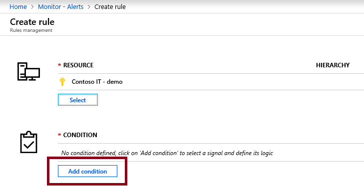

# Configure Azure Advisor alerts in ServiceNow

This article shows you how to integrate Azure Advisor alerts with ServiceNow using a webhook. After setting up webhook integration with your ServiceNow instance, you get alerts through your existing notification infrastructure when a new Azure Advisor recommendation is available. Every time an Azure Advisor alert fires, it calls a webhook through ServiceNow's Scripted REST API.

You can follow the steps below to create a new change request in ServiceNow whenever a new Azure Advisor recommendation is available. Once the change request is Approved within ServiceNow, the responsible person can then implement the suggested action(s) associated with the Azure Advisor recommendation.


### Create a new table in ServiceNow

1. In ServiceNow, navigate to Tables and click on New.


2. Provide an appropriate label and name similar to what is shown below.


3. Note the Name of the new table, you will need it in the next step.

### Create a scripted REST API in ServiceNow

1. Follow steps 1 through 7 in [this article](https://docs.microsoft.com/en-us/azure/service-health/service-health-alert-webhook-servicenow).

2. In the Script section, add the following JavaScript code: 

>You need to update the `<secret>`,`<group>`, and `<email>` value in the script below.
>* `<secret>` should be a random string, like a GUID
>* `<group>` should be the ServiceNow group you want to assign the incident to
>* `<email>` should be the specific person you want to assign the incident to (optional)
>* `<name>` should be the name of the table that you created. In the above example, it is *x_mioms_microsoft_advisor_recommendation*.

```javascript
    (function process( /*RESTAPIRequest*/ request, /*RESTAPIResponse*/ response) {
        var apiKey = request.queryParams['apiKey'];
        var secret = '<secret>';
        if (apiKey == secret) {
            var event = request.body.data;
            var responseBody = {};
            if (event.data.context.activityLog.operationName == 'Microsoft.Advisor/recommendations/available/action') {
                var inc = new GlideRecord('<name>');
                inc.initialize();
                inc.short_description = "A new " + event.data.context.activityLog.properties.recommendationCategory + " recommendation is available.";
                inc.description = event.data.context.activityLog.description + "\n";
                inc.description += "Category: " + event.data.context.activityLog.properties.recommendationCategory + "\n";
                inc.description += "Impact: " + event.data.context.activityLog.properties.recommendationImpact + "\n";
                inc.description += "Name: " + event.data.context.activityLog.properties.recommendationName + "\n";
                inc.description += "Link: " + event.data.context.activityLog.properties.recommendationResourceLink + "\n";
                inc.description += "Type: " + event.data.context.activityLog.properties.recommendationType + "\n";
                inc.description += "Subscription: " + event.data.context.activityLog.subscriptionId + "\n";
                inc.work_notes = "Impacted subscription: " + event.data.context.activityLog.subscriptionId;
                inc.state = 2;
                inc.impact = 2;
                inc.urgency = 2;
                inc.priority = 2;
                inc.assigned_to = '<email>';
                inc.assignment_group.setDisplayValue('<group>');
                inc.insert();
                responseBody.message = "Event created.";
            } else {
                responseBody.message = "Not a new recommendation event, ignored.";
            }
            response.setBody(responseBody);
        } else {
            var unauthorized = new sn_ws_err.ServiceError();
            unauthorized.setStatus(401);
            unauthorized.setMessage('Invalid apiKey');
            response.setError(unauthorized);
        }
    })(request, response);
```

3. Follow steps 9 through 11 in [this article](https://docs.microsoft.com/en-us/azure/service-health/service-health-alert-webhook-servicenow) and note the full Integration URL, it should look like below.

```
https://<yourInstanceName>.service-now.com/<baseApiPath>?apiKey=<secret>
```

### Create a new alert rule

1. Navigate to [Azure Monitor](https://ms.portal.azure.com/#blade/Microsoft_Azure_Monitoring/AzureMonitoringBrowseBlade/alertsV2)
2. Click on New alert rule.


3. Click on Select button and select the appropriate resource.


4. Click on Add condition.



5. In the new window that comes up, select Activity Log - Recommendation in the Monitor service dropdown.


6. Use an existing action group or create a new one. For instructions on how to create an action group, [click here](https://docs.microsoft.com/en-us/azure/azure-monitor/platform/action-groups).

7. Define in the list of Actions:
	a. Action Type: Webhook
	b. Details: The ServiceNow Integration URL you previously saved.
	c. Name: Webhook's name, alias, or identifier.

8. Select Save when done to create the alert.

### See and approve change requests in ServiceNow

Whenever there is a new Azure Advisor recommendation for the resource you selected, you will see a new activity log event. The alert rule you created in the previous step will be triggered and you will see a new Change Request in ServiceNow as shown below.


When you click on the Change Request, you will see the details as shown below.


You can then use your normal process to get the change request approved.

Once the change request is approved, you can click on the Link to go to Azure Advisor and follow the recommended actions.
